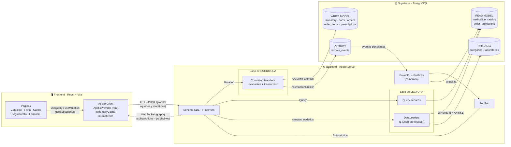
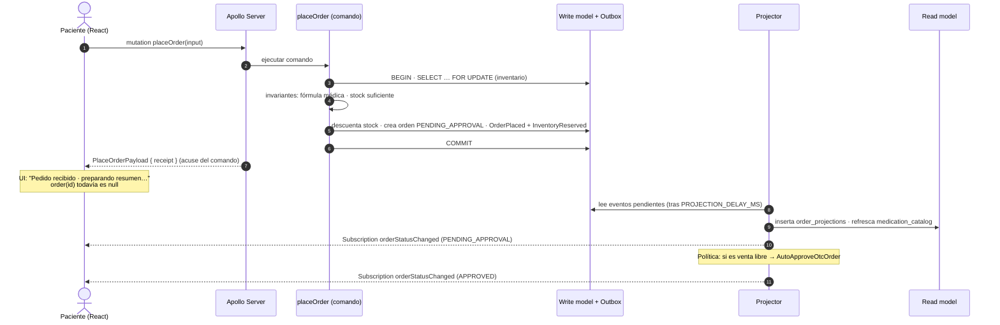

# Afirmative Pill — E-commerce farmacéutico con GraphQL + CQRS

Plataforma de venta de medicamentos en línea construida sobre dos pilares arquitectónicos:

- **Comunicación exclusiva por GraphQL** (Zero-REST): Queries, Mutations y Subscriptions contra un único endpoint `/graphql`.
- **CQRS**: los comandos (mutations) escriben en un *write model* transaccional; las consultas (queries) leen de *proyecciones* optimizadas que se actualizan de forma asíncrona (consistencia eventual).

> Taller práctico · Ingeniería de Software Avanzada / Patrones Arquitectónicos · Caso de estudio "Afirmative Pill".

> 📚 **Documentación para la evaluación:** la carpeta [`docs/`](docs/README.md) reúne la justificación de diseño y la evidencia de cada criterio de la rúbrica (logs reales del N+1, invariantes, consistencia eventual, caché de Apollo e índices), con enlaces al código exacto.

---

## 🚀 Aplicación desplegada

| | Enlace | Qué es |
|---|---|---|
| **Aplicación web** | [afirmative-pill-patrones.vercel.app](https://afirmative-pill-patrones.vercel.app) | Frontend React (Vercel). Catálogo, carrito, seguimiento de pedidos y bandeja del farmacéutico. |
| **API GraphQL** | [afirmative-pill-api.onrender.com/graphql](https://afirmative-pill-api.onrender.com/graphql) | Único endpoint del backend (Render). Al abrirlo en el navegador carga **Apollo Sandbox** para explorar el schema y ejecutar operaciones. |

**Cuentas de demostración**

| Rol | Correo | Contraseña |
|---|---|---|
| Paciente | `paciente@afirmativepill.co` | `Paciente123*` |
| Químico farmacéutico | `farmacia@afirmativepill.co` | `Farmacia123*` |

Para probar un pedido con fórmula médica, el documento del paciente es `1000000001`.

> ⏳ **Primera carga:** el backend está en el plan gratuito de Render, que suspende el servicio tras 15 minutos sin uso. Si el catálogo tarda en aparecer, espera hasta un minuto mientras se reactiva; después responde con normalidad.
>
> 💡 **Tiempo real:** para ver las *subscriptions*, abre la aplicación en dos ventanas (una como paciente y otra, en incógnito, como farmacéutico). Al aprobar o despachar un pedido, la ventana del paciente se actualiza sola.

---

## Tabla de contenido

1. [Stack tecnológico](#1-stack-tecnológico)
2. [Arquitectura](#2-arquitectura)
3. [Estructura del repositorio](#3-estructura-del-repositorio)
4. [Arranque local](#4-arranque-local)
5. [Diseño del schema GraphQL](#5-diseño-del-schema-graphql)
6. [Aplicación de CQRS](#6-aplicación-de-cqrs)
7. [Mitigación del problema N+1](#7-mitigación-del-problema-n1)
8. [Frontend: Apollo Client y caché](#8-frontend-apollo-client-y-caché)
9. [Zero-REST: cómo se garantiza](#9-zero-rest-cómo-se-garantiza)
10. [Pruebas](#10-pruebas)
11. [Despliegue (Supabase + Render + Vercel)](#11-despliegue)
12. [Decisiones y limitaciones conocidas](#12-decisiones-y-limitaciones-conocidas)
13. [Schema SDL completo](#13-schema-sdl-completo)

---

## 1. Stack tecnológico

| Capa | Tecnología |
|---|---|
| Lenguaje | TypeScript (backend y frontend) |
| Backend | Node.js + **Apollo Server 5** sobre Express (monolito modular) |
| Subscriptions | `graphql-ws` + `ws` en el mismo endpoint `/graphql` |
| Resolución en lote | **DataLoader** (instancias nuevas por request) |
| Scalars | `graphql-scalars` (`DateTime`, `Date`, `PositiveInt`, `NonEmptyString`, `EmailAddress`) + propios (`Money`, `SKU`) |
| Validación de comandos | Zod |
| Base de datos | **PostgreSQL en Supabase** (acceso con `pg` y transacciones reales) |
| Frontend | **React 19 + Vite** + React Router |
| Cliente GraphQL | **Apollo Client 4** (`ApolloProvider`, `InMemoryCache`, `useQuery`/`useMutation`/`useSubscription`) |
| Estilos | Tailwind CSS 4 |
| Tipado de operaciones | GraphQL Code Generator (`client-preset`) |
| Pruebas | Vitest (dominio) + prueba de humo end-to-end (`npm run smoke`) |
| Despliegue | Supabase (BD) + Render (backend) + Vercel (frontend) |

---

## 2. Arquitectura

### 2.1 Vista general



### 2.2 Flujo de un pedido y consistencia eventual



---

## 3. Estructura del repositorio

```
TALLER3C2/
├── database/                      # SQL versionado (se ejecuta en Supabase)
│   ├── migrations/
│   │   ├── 001_catalog.sql        # extensiones, dataset staging, catálogo normalizado
│   │   ├── 002_write_model.sql    # usuarios, inventario, carritos, órdenes, fórmulas, outbox
│   │   ├── 003_read_model.sql     # proyecciones + índices (trigram, facetas)
│   │   └── 004_security.sql       # RLS: bloquea la API REST automática de Supabase
│   ├── seed/
│   │   ├── 001_medications_dataset.sql   # los 50 medicamentos del dataset
│   │   ├── 002_normalize_catalog.sql     # dataset → categorías/laboratorios/medicamentos/inventario
│   │   ├── 003_demo_users.sql            # paciente y farmacéutico de prueba
│   │   └── medications_dataset.csv       # mismo dataset en CSV (importación opcional)
│   ├── supabase_setup.sql         # TODO lo anterior en un único script (SQL Editor)
│   └── reset.sql                  # elimina el esquema (destructivo)
│
├── backend/                       # Apollo Server
│   ├── schema.graphql             # ← CONTRATO SDL (fuente única de verdad)
│   ├── api/graphql.js             # entrada serverless para Vercel
│   ├── vercel.json
│   ├── scripts/                   # db:setup, db:bundle, smoke test, embed-schema
│   └── src/
│       ├── domain/                # reglas de negocio puras: estados, fórmula, errores, eventos
│       ├── commands/              # WRITE SIDE: command handlers (transacciones + outbox)
│       ├── queries/               # READ SIDE: consultas al read model
│       ├── projections/           # projector, proyecciones y políticas (asíncrono)
│       ├── dataloaders/           # DataLoaders por request (anti N+1)
│       ├── graphql/               # scalars, contexto, resolvers, plugin de logs
│       ├── infra/                 # pool PG, logger, PubSub, tareas en segundo plano
│       ├── http/app.ts            # Express + Apollo (solo /graphql)
│       ├── local-server.ts        # servidor local HTTP + WebSocket
│       └── vercel-handler.ts      # handler serverless
│
├── frontend/                      # React + Vite + Apollo Client + Tailwind
│   ├── codegen.ts                 # GraphQL Code Generator
│   ├── vercel.json
│   └── src/
│       ├── apollo/                # cliente, links (HTTP/WS/auth/errores), caché, reactive vars
│       ├── auth/                  # AuthContext (login/logout por GraphQL)
│       ├── graphql/operations.ts  # todas las queries/mutations/subscriptions/fragmentos
│       ├── gql/                   # tipos generados por codegen
│       ├── hooks/                 # useCartActions (mutations + caché), useDebounced
│       ├── components/            # UI, badges, layout, componentes de orden
│       └── pages/                 # Catálogo, Ficha, Carrito, Pedidos, Seguimiento, Farmacia, Login
│
└── docs/                          # documentación técnica para la evaluación
    ├── README.md                  # índice y mapa de la rúbrica
    ├── 01_ARQUITECTURA.md         # diagramas de componentes, despliegue y flujo
    ├── 02_GRAPHQL.md              # diseño del schema, over-fetching, Zero-REST
    ├── 03_N1_DATALOADER.md        # problema N+1 y logs reales de DataLoader
    ├── 04_CQRS.md                 # segregación, invariantes, consistencia eventual
    ├── 05_FRONTEND_APOLLO.md      # ApolloProvider, caché, hooks, subscriptions
    └── 06_SUPABASE.md             # dataset, modelo de datos, índices, RLS
```

---

## 4. Arranque local

### Requisitos

- Node.js **20 o superior** (probado con Node 24).
- Un proyecto de **Supabase** con el script [`database/supabase_setup.sql`](database/supabase_setup.sql) ejecutado en el SQL Editor. `DATABASE_URL` debe ser la URI del **Session pooler** (puerto 5432).
  - Alternativa sin internet: un PostgreSQL local, por ejemplo `docker run -d --name afirmative-pg -e POSTGRES_PASSWORD=postgres -p 54329:5432 postgres:17-alpine`.

### Pasos

```bash
# 1) Backend
cd backend
cp .env.example .env          # completa DATABASE_URL y JWT_SECRET
npm install
npm run db:setup              # crea tablas, índices, proyecciones y carga los 50 medicamentos
npm run dev                   # http://localhost:4000/graphql  (HTTP + WebSocket)

# 2) Frontend (otra terminal)
cd frontend
cp .env.example .env
npm install
npm run dev                   # http://localhost:5173
```

> En Windows (PowerShell) usa `Copy-Item .env.example .env` en lugar de `cp`.

Abre **http://localhost:4000/graphql** para usar Apollo Sandbox y explorar el schema, o **http://localhost:5173** para la aplicación.

### Cuentas de demostración

| Rol | Correo | Contraseña |
|---|---|---|
| Paciente | `paciente@afirmativepill.co` | `Paciente123*` |
| Químico farmacéutico | `farmacia@afirmativepill.co` | `Farmacia123*` |

El documento del paciente demo es `1000000001`; la fórmula médica debe tener ese mismo documento.

### Variables de entorno clave (backend)

| Variable | Para qué sirve |
|---|---|
| `DATABASE_URL` | Cadena de conexión de Supabase |
| `JWT_SECRET` | Firma de los tokens de sesión |
| `PROJECTION_DELAY_MS` | Retardo del proyector (hace visible la consistencia eventual). Por defecto 1500 |
| `AUTO_APPROVE_DELAY_MS` | Tiempo de la aprobación automática de pedidos sin fórmula. Por defecto 4000 |
| `DISABLE_DATALOADER` | `true` desactiva el batching para **demostrar el N+1** |
| `LOG_SQL` | Imprime cada SQL ejecutado |

---

## 5. Diseño del schema GraphQL

El contrato completo está en [`backend/schema.graphql`](backend/schema.graphql) (y [al final de este README](#13-schema-sdl-completo)). Decisiones principales:

| Elemento | Decisión | Justificación |
|---|---|---|
| **Scalars personalizados** | `Money` (COP entero ≥ 0), `SKU` (`MED-000`), `DateTime`, `Date`, `PositiveInt`, `NonEmptyString`, `EmailAddress` | La validación de formato ocurre en el borde del contrato, antes de llegar al dominio. |
| **Enums** | `OrderStatus`, `PrescriptionStatus`, `AvailabilityStatus`, `ErrorCode`, `Role`, `CartStatus`, `PrescriptionDecision`, `MedicationSortField`, `SortDirection` | Estados finitos y códigos de error estables con los que el cliente reacciona sin comparar textos. |
| **Inputs** | Un `input` por comando (`PlaceOrderInput`, `PrescriptionInput`, `AddItemToCartInput`…) y `MedicationFilter`/`MedicationSort` para las consultas | Las mutations expresan intención de negocio, no CRUD genérico. |
| **Payloads como uniones** | `PlaceOrderResult = PlaceOrderPayload \| PrescriptionRequiredError \| InsufficientStockError \| …` | Los errores de negocio son **datos tipados** del contrato (con detalle: faltantes de stock, medicamentos que exigen fórmula, errores por campo) y no excepciones genéricas. |
| **`interface DomainError`** | Todos los errores de dominio exponen `code` y `message` | El cliente puede tratar cualquier error con `... on DomainError`. |
| **Errores transversales** | Autenticación y autorización se devuelven como errores GraphQL con `extensions.code` (`UNAUTHENTICATED`, `FORBIDDEN`) | Son preocupaciones transversales, no resultados de negocio. |
| **Paginación** | `MedicationConnection` estilo Relay (cursor opaco, `pageInfo`, `totalCount`) | Se integra con `relayStylePagination` de Apollo Client para concatenar páginas. |
| **Acuse vs. proyección** | Las mutations de orden devuelven `OrderReceipt` (write model); `Query.order` devuelve `OrderSummary` (read model) | Hace **explícita** la separación CQRS y la consistencia eventual en el propio contrato. |
| **Selección selectiva** | La tarjeta del catálogo pide 7 campos; la ficha detallada pide laboratorio, indicaciones, principio activo, etc. | Evita el *over-fetching* en redes móviles (ver `QueryInspector` en la UI). |

---

## 6. Aplicación de CQRS

### 6.1 Separación de modelos

| | **Write model** (comandos) | **Read model** (consultas) |
|---|---|---|
| Tablas | `inventory`, `carts`, `cart_items`, `orders`, `order_items`, `prescriptions`, `users` | `medication_catalog`, `order_projections` (+ referencia `categories`, `laboratories`) |
| Quién escribe | Solo `backend/src/commands/*` | Solo el **Projector** (`backend/src/projections/*`) |
| Quién lee | Los propios comandos, para validar invariantes | `backend/src/queries/*` y los DataLoaders |
| Forma | Normalizada y transaccional | Desnormalizada: documento de búsqueda precalculado, ítems e historial en JSONB |

Las mutations nunca devuelven la proyección. Devuelven un **acuse** (`OrderReceipt`) con el estado confirmado por la transacción. Las queries nunca invocan comandos.

### 6.2 Comandos (intención de negocio)

`createCart`, `addItemToCart`, `updateCartItemQuantity`, `removeItemFromCart`, `clearCart`, `placeOrder`, `cancelOrder`, `reviewPrescription`, `dispatchOrder`, además del comando de sistema `AutoApproveOtcOrder`, que dispara una política.

### 6.3 Invariantes de negocio protegidas

| Invariante | Dónde se protege |
|---|---|
| Un pedido con medicamentos `requires_prescription = true` **exige fórmula** | `placeOrder` → `PrescriptionRequiredError` (lista los medicamentos afectados) |
| La fórmula debe ser vigente (≤ 30 días, no futura), del **mismo paciente** y con registro médico válido | `domain/prescription.ts` → `ValidationError` por campo |
| **No vender lo que no hay**: la reserva de stock es atómica | Transacción con `SELECT … FOR UPDATE` en orden ascendente de id (evita interbloqueos) y luego `UPDATE`; además `CHECK (stock >= 0)` en la BD como última defensa → `InsufficientStockError` |
| Máximo 10 unidades por medicamento | Comandos del carrito → `ValidationError` |
| Máquina de estados: `PENDING_APPROVAL → APPROVED → DISPATCHED`, cancelación solo antes del despacho | `domain/order.ts` → `InvalidStateTransitionError` |
| Una orden con fórmula solo la aprueba un químico farmacéutico; las de venta libre se aprueban automáticamente | `reviewPrescription` (rol `PHARMACIST`) + política `AutoApproveOtcOrder` |
| Un carrito confirmado no puede volver a comprarse; un doble clic no duplica pedidos | `carts.status` + `idempotencyKey` único por usuario |
| Cancelar o rechazar la fórmula **devuelve el stock** | `releaseInventory` en la misma transacción |

### 6.4 Consistencia eventual: estrategia

1. **Transactional Outbox.** Cada comando registra sus eventos (`OrderPlaced`, `InventoryReserved`, `OrderApproved`, …) en `domain_events` **dentro de la misma transacción**. O se confirma todo o no se confirma nada.
2. **Projector asíncrono.** Tras el COMMIT, y después de `PROJECTION_DELAY_MS`, aplica los eventos en orden a las proyecciones. Un *advisory lock* de PostgreSQL garantiza un único proyector y los handlers son idempotentes (`last_event_id`). Un barrido periódico recupera eventos que hayan quedado pendientes.
3. **Qué ve el usuario mientras tanto:**
   - Tras `placeOrder`, el cliente guarda el **acuse** en una *reactive var* (`pendingOrdersVar`) y muestra "Pedido recibido · preparando resumen…" mientras `order(id)` sea `null`. En ese estado hace *polling* hasta que la proyección aparece.
   - "Mis pedidos" muestra tarjetas **"Procesando…"** para los acuses que aún no están en el read model.
   - Los cambios de estado llegan por **Subscription** (`orderStatusChanged`) y se escriben en la caché. Cada evento proyectado se publica, así que el cliente ve todas las transiciones.
   - Tras un comando posterior (cancelar, aprobar, despachar), la caché refleja **al instante** el estado confirmado por el write model (`cache.modify`) y la UI muestra "Sincronizando…" hasta que `projectionVersion` avanza.
   - En el catálogo, la disponibilidad se marca como "sincronizada hace X s · se confirma al pagar": el read model puede ir unos instantes atrás, pero el comando **siempre valida contra el write model**.

---

## 7. Mitigación del problema N+1

- En cada request se crea un juego **nuevo** de DataLoaders (`backend/src/dataloaders/index.ts`). La caché queda aislada por petición y usuario.
- Loaders: `medicationById`, `categoryById`, `laboratoryById`, `medicationsByCategoryId`, `medicationCountByCategoryId`.
- Todas las relaciones anidadas pasan por ellos: `Medication.category`, `Medication.laboratory`, `CartItem.medication`, `OrderLine.medication`, `StockShortage.medication`, `PrescriptionRequiredError.medications`, `Category.medications`, `Category.medicationCount`.
- Cada lote se resuelve con **una** consulta `WHERE id = ANY($1)`. Además, `Query.medications` pre-carga (`prime`) el loader con las filas ya leídas.

**Evidencia medida contra Supabase** con la consulta `medications(first: 12) { name category { name } laboratory { name } }`:

| Modo | Consultas SQL |
|---|---|
| `DISABLE_DATALOADER=true` (N+1) | **25** (1 + 12 categorías + 12 laboratorios) |
| DataLoader activo | **3** (1 + 1 lote de categorías + 1 lote de laboratorios) |

Así se ve en los logs reales del servidor. Los 12 medicamentos comparten categorías y laboratorios, así que DataLoader además **deduplica**: pide 8 categorías y 8 laboratorios distintos.

```
GRAPHQL     ▶ query DemoN1
SQL         select medication_id, sku, name, … from medication_catalog … [12,0] → 12 filas · 115.9ms
DATALOADER  categoryById · lote de 8 claves [14, 3, 5, 4, 11, 10, 6, 1] → 1 consulta SQL
DATALOADER  laboratoryById · lote de 8 claves [2, 12, 9, 1, 7, 14, 15, 10] → 1 consulta SQL
SQL         select id, name, slug from categories where id = any($1::int[]) → 8 filas · 115.7ms
SQL         select id, name from laboratories where id = any($1::int[]) → 8 filas · 788.4ms
GRAPHQL     ◀ query DemoN1 · 3 consultas SQL · 2 lotes DataLoader · 924ms
```

Los logs completos de ambos modos, otra consulta de ejemplo (15 → 2 consultas) y cómo reproducirlo están en [docs/03_N1_DATALOADER.md](docs/03_N1_DATALOADER.md).

La vista condensada del catálogo (`query Catalog`) ni siquiera pide `category` ni `laboratory`, así que se resuelve con **1 sola consulta SQL**. Es la ventaja de la selección selectiva de campos.

---

## 8. Frontend: Apollo Client y caché

- **`ApolloProvider` en la raíz** (`frontend/src/main.tsx`): toda la app comparte un único cliente y una única caché.
- **Links** (`frontend/src/apollo/client.ts`): `ErrorLink` → `SetContextLink` (JWT) → `split` que envía las subscriptions por `GraphQLWsLink` y el resto por `HttpLink`, ambos contra `/graphql`.
- **`InMemoryCache`**:
  - `possibleTypes` generados por codegen, para los fragmentos sobre uniones e interfaces.
  - `relayStylePagination(['filter','sort'])` para el catálogo: `fetchMore` concatena páginas.
  - `typePolicies` para listas que se reemplazan (`items`, `statusHistory`) y objetos embebidos (`Availability`).
- **Hooks idiomáticos**: `useQuery` con `loading`/`error`/`data` y `notifyOnNetworkStatusChange`; `useMutation` con `update`; `useSubscription` con `onData`; `useReactiveVar`.
- **Actualización inteligente de la caché tras mutations**:

  | Mutation | Cómo se actualiza la caché |
  |---|---|
  | Carrito | El `Cart` devuelto se normaliza por `id`, así que el contador del header se actualiza solo. `update` escribe `Query.myCart` cuando el carrito se acaba de crear. |
  | `updateCartItemQuantity` / `removeItemFromCart` | Usan `optimisticResponse` y la UI cambia antes de que responda el servidor. |
  | `placeOrder` | `cache.modify` deja `myCart` en `null`, `cache.evict` retira el carrito y la lista `myOrders`, y luego `cache.gc()`. |
  | `cancelOrder`, `reviewPrescription`, `dispatchOrder` | `cache.modify` cambia el estado de la entidad `OrderSummary` y retira la orden de la bandeja actual. |

- **Subscriptions**: `orderStatusChanged` escribe la proyección recibida con `client.writeQuery`. `orderFeed` refresca la bandeja del farmacéutico.
- **Estado local**: *reactive vars* para el token (`authTokenVar`) y para los acuses pendientes (`pendingOrdersVar`).

---

## 9. Zero-REST: cómo se garantiza

- El backend monta **una sola ruta**: `/graphql` (HTTP para queries/mutations y WebSocket para subscriptions). No hay ninguna otra ruta de datos. (En el adaptador serverless alternativo para Vercel, `/graphql` se reescribe a la función `/api/graphql`, que es el mismo servidor GraphQL.)
- El login y el registro también son mutations (`login`, `register`).
- El frontend no usa `fetch` directo: todo pasa por Apollo Client. La prueba en navegador (Edge + Playwright) confirmó que **no hubo ninguna petición fetch/XHR/WS fuera de `/graphql`**.
- Supabase genera automáticamente una API REST (PostgREST). La migración `004_security.sql` activa **Row Level Security sin políticas** en todas las tablas, así que esa API queda inutilizable para los roles públicos y el único camino a los datos es el backend GraphQL.

---

## 10. Pruebas

```bash
cd backend
npm test          # Vitest: máquina de estados y reglas de la fórmula médica
npm run smoke     # E2E contra el backend en ejecución (26 verificaciones):
                  # catálogo, auth, carrito, invariantes, placeOrder, proyección
                  # eventual, subscription, farmacéutico, auto-aprobación OTC, cancelación
```

`npm run smoke` acepta `GRAPHQL_URL=https://…/graphql` para probar el despliegue. Si el backend no admite WebSocket (Vercel), añade `SKIP_WS=true`.

---

## 11. Despliegue

| Pieza | Plataforma | Notas |
|---|---|---|
| Base de datos | **Supabase** (PostgreSQL) | Se crea ejecutando [`database/supabase_setup.sql`](database/supabase_setup.sql) en el SQL Editor. El backend se conecta por el *Session pooler* (puerto 5432). |
| Backend | **Render** (Web Service, Root Directory `backend`) | Build: `npm install --include=dev && npm run build` · Start: `npm start`. Servidor persistente con HTTP + WebSocket en `/graphql`. |
| Frontend | **Vercel** (Root Directory `frontend`) | Variables: `VITE_GRAPHQL_HTTP_URL`, `VITE_GRAPHQL_WS_URL` y `VITE_ENABLE_SUBSCRIPTIONS=true`. |

El diagrama de despliegue está en [docs/01_ARQUITECTURA.md](docs/01_ARQUITECTURA.md#3-despliegue).

---

## 12. Decisiones y limitaciones conocidas

- **Backend en Render (servidor persistente).** Se eligió Render porque mantiene conexiones WebSocket, así que las subscriptions funcionan en producción. En el plan gratuito el servicio se suspende tras 15 minutos sin tráfico y la primera petición tarda unos 50 segundos.
- **Alternativa serverless:** el backend también puede correr en Vercel (`vercel-handler.ts`, con el proyector en `waitUntil`), pero Vercel no mantiene WebSocket y el frontend usa *polling* (`VITE_ENABLE_SUBSCRIPTIONS=false`).
- **PubSub en memoria:** suficiente para una instancia. Con varias réplicas habría que usar Redis o PostgreSQL `LISTEN/NOTIFY`.
- **Retardos artificiales** (`PROJECTION_DELAY_MS`, `AUTO_APPROVE_DELAY_MS`): existen para **hacer visible** la consistencia eventual en la demostración. En producción pueden ser `0`.
- **Dataset:** se corrigieron tres erratas tipográficas del archivo original (MED-017 "Hdoclorotiazida", MED-034 "Aprazolam", MED-050 "Frsco"), documentadas en `database/seed/001_medications_dataset.sql`.
- **Fórmula médica:** se registra como datos estructurados más un enlace opcional al documento. No se suben archivos, porque eso requeriría un canal adicional.

---

## 13. Schema SDL completo

Fuente: [`backend/schema.graphql`](backend/schema.graphql). Esta sección se sincroniza automáticamente con `npm run schema:embed`.

<details>
<summary><strong>Ver schema.graphql</strong></summary>

<!-- SDL:START -->

```graphql
"""
=====================================================================
 AFIRMATIVE PILL · Contrato GraphQL (único canal cliente-servidor)
---------------------------------------------------------------------
 CQRS aplicado al contrato:
   • Query        → lee SOLO del READ MODEL (proyecciones).
   • Mutation     → COMANDOS con intención de negocio sobre el WRITE MODEL.
                    Devuelven uniones de resultado: éxito | errores de dominio.
   • Subscription → notifica cambios de la proyección de órdenes.
 Errores transversales (autenticación/autorización) se devuelven como
 errores GraphQL con extensions.code = UNAUTHENTICATED | FORBIDDEN.
=====================================================================
"""
schema {
  query: Query
  mutation: Mutation
  subscription: Subscription
}

# ════════════════════════════════════════════════════════════════════
#  SCALARS PERSONALIZADOS
# ════════════════════════════════════════════════════════════════════

"Fecha y hora ISO-8601 en UTC (ej: 2026-09-23T15:04:05.000Z)."
scalar DateTime

"Fecha calendario ISO-8601 sin hora (ej: 2026-09-23)."
scalar Date

"Entero estrictamente mayor que cero."
scalar PositiveInt

"Texto que no puede estar vacío ni ser solo espacios."
scalar NonEmptyString

"Correo electrónico válido (RFC 5322)."
scalar EmailAddress

"""
Valor monetario en pesos colombianos (COP) sin decimales.
Se serializa como entero y rechaza negativos o fracciones.
"""
scalar Money

"Código de inventario de un medicamento con formato MED-000."
scalar SKU

# ════════════════════════════════════════════════════════════════════
#  ENUMS
# ════════════════════════════════════════════════════════════════════

enum Role {
  PATIENT
  PHARMACIST
}

"Estados operacionales de una orden."
enum OrderStatus {
  "Comando aceptado; en validación (fórmula médica / aprobación automática)."
  PENDING_APPROVAL
  "Validada y lista para despacho."
  APPROVED
  "Entregada a la transportadora."
  DISPATCHED
  "Cancelada por el paciente o rechazada por el farmacéutico. El stock se libera."
  CANCELLED
}

enum PrescriptionStatus {
  PENDING_REVIEW
  APPROVED
  REJECTED
}

enum PrescriptionDecision {
  APPROVE
  REJECT
}

"Disponibilidad proyectada en el catálogo (puede tener un leve retraso: consistencia eventual)."
enum AvailabilityStatus {
  IN_STOCK
  LOW_STOCK
  OUT_OF_STOCK
}

enum CartStatus {
  OPEN
  CHECKED_OUT
}

enum MedicationSortField {
  NAME
  PRICE
}

enum SortDirection {
  ASC
  DESC
}

"Códigos estables de error de dominio para que el cliente reaccione sin parsear textos."
enum ErrorCode {
  VALIDATION_FAILED
  NOT_FOUND
  INSUFFICIENT_STOCK
  PRESCRIPTION_REQUIRED
  INVALID_STATE_TRANSITION
  EMPTY_CART
  INVALID_CREDENTIALS
  EMAIL_ALREADY_REGISTERED
}

# ════════════════════════════════════════════════════════════════════
#  CATÁLOGO (READ MODEL)
# ════════════════════════════════════════════════════════════════════

type Category {
  id: ID!
  name: String!
  slug: String!
  "Número de medicamentos de la categoría (resuelto en lote con DataLoader)."
  medicationCount: Int!
  "Medicamentos de la categoría (resuelto en lote con DataLoader)."
  medications(first: Int = 10): [Medication!]!
}

type Laboratory {
  id: ID!
  name: String!
}

"Disponibilidad proyectada. syncedAt indica cuándo se sincronizó la proyección."
type Availability {
  status: AvailabilityStatus!
  unitsAvailable: Int!
  syncedAt: DateTime!
}

"""
Ficha de un medicamento. El cliente elige qué campos pedir:
la vista condensada pide nombre/precio/presentación; la ficha
detallada añade laboratorio, descripción, principio activo, etc.
"""
type Medication {
  id: ID!
  sku: SKU!
  name: String!
  activeIngredient: String!
  dosage: String!
  presentation: String!
  price: Money!
  requiresPrescription: Boolean!
  "Indicaciones / descripción clínica."
  description: String!
  "Relación anidada resuelta con DataLoader (sin N+1)."
  category: Category!
  "Relación anidada resuelta con DataLoader (sin N+1)."
  laboratory: Laboratory!
  availability: Availability!
}

type PageInfo {
  hasNextPage: Boolean!
  hasPreviousPage: Boolean!
  startCursor: String
  endCursor: String
}

type MedicationEdge {
  cursor: String!
  node: Medication!
}

"Paginación estilo Relay (cursor) para el catálogo."
type MedicationConnection {
  edges: [MedicationEdge!]!
  pageInfo: PageInfo!
  totalCount: Int!
}

"Filtros facetados del catálogo. Todos son opcionales y se combinan con AND."
input MedicationFilter {
  "Busca en nombre comercial, principio activo, categoría, laboratorio y SKU (sin distinguir tildes)."
  search: String
  "Filtra por principio activo (coincidencia parcial)."
  activeIngredient: String
  categoryId: ID
  laboratoryId: ID
  requiresPrescription: Boolean
  availability: AvailabilityStatus
  minPrice: Money
  maxPrice: Money
}

input MedicationSort {
  field: MedicationSortField! = NAME
  direction: SortDirection! = ASC
}

# ════════════════════════════════════════════════════════════════════
#  USUARIOS / AUTENTICACIÓN
# ════════════════════════════════════════════════════════════════════

type User {
  id: ID!
  email: EmailAddress!
  fullName: String!
  documentNumber: String!
  role: Role!
}

input LoginInput {
  email: EmailAddress!
  password: NonEmptyString!
}

input RegisterInput {
  email: EmailAddress!
  password: NonEmptyString!
  fullName: NonEmptyString!
  documentNumber: NonEmptyString!
}

type AuthPayload {
  token: String!
  user: User!
}

# ════════════════════════════════════════════════════════════════════
#  CARRITO (agregado transaccional del servidor)
# ════════════════════════════════════════════════════════════════════

type Cart {
  id: ID!
  status: CartStatus!
  items: [CartItem!]!
  "Unidades totales en el carrito."
  itemCount: Int!
  subtotal: Money!
  "true si al menos un ítem exige fórmula médica."
  requiresPrescription: Boolean!
  updatedAt: DateTime!
}

type CartItem {
  "Identificador compuesto cartId:medicationId (estable para la caché de Apollo)."
  id: ID!
  quantity: PositiveInt!
  lineTotal: Money!
  "Resuelto en lote con DataLoader."
  medication: Medication!
}

input AddItemToCartInput {
  medicationId: ID!
  quantity: PositiveInt! = 1
}

input UpdateCartItemQuantityInput {
  medicationId: ID!
  quantity: PositiveInt!
}

input RemoveItemFromCartInput {
  medicationId: ID!
}

type CartPayload {
  cart: Cart!
}

# ════════════════════════════════════════════════════════════════════
#  ÓRDENES
# ════════════════════════════════════════════════════════════════════

"Soporte de la fórmula médica exigido cuando algún ítem requiere prescripción."
input PrescriptionInput {
  doctorName: NonEmptyString!
  "Registro médico (tarjeta profesional) del prescriptor."
  doctorLicense: NonEmptyString!
  "Documento del paciente que figura en la fórmula."
  patientDocument: NonEmptyString!
  "Fecha de expedición. No puede ser futura ni tener más de 30 días."
  issuedAt: Date!
  "Enlace opcional a la imagen o PDF de la fórmula."
  documentUrl: String
  notes: String
}

input PlaceOrderInput {
  cartId: ID!
  shippingAddress: NonEmptyString!
  "Obligatorio si el carrito contiene medicamentos con requiresPrescription = true."
  prescription: PrescriptionInput
  "Clave opcional para que un doble envío del mismo comando no cree dos órdenes."
  idempotencyKey: String
}

input CancelOrderInput {
  orderId: ID!
  reason: NonEmptyString!
}

input ReviewPrescriptionInput {
  orderId: ID!
  decision: PrescriptionDecision!
  "Obligatorias cuando la decisión es REJECT."
  notes: String
}

input DispatchOrderInput {
  orderId: ID!
}

"""
Acuse de recibo de un comando sobre una orden (WRITE MODEL).
Refleja el estado confirmado por la transacción; la proyección
(OrderSummary) se actualiza instantes después (consistencia eventual).
"""
type OrderReceipt {
  orderId: ID!
  code: String!
  status: OrderStatus!
  total: Money!
  requiresPrescription: Boolean!
  acceptedAt: DateTime!
}

type PlaceOrderPayload {
  receipt: OrderReceipt!
}

type OrderCommandPayload {
  receipt: OrderReceipt!
}

"Línea de la orden proyectada (snapshot del precio al momento de comprar)."
type OrderLine {
  medicationId: ID!
  sku: SKU!
  name: String!
  quantity: PositiveInt!
  unitPrice: Money!
  subtotal: Money!
  requiresPrescription: Boolean!
  "Ficha actual del medicamento, resuelta en lote con DataLoader."
  medication: Medication
}

type PrescriptionSummary {
  status: PrescriptionStatus!
  doctorName: String!
  doctorLicense: String!
  patientDocument: String!
  issuedAt: Date!
  documentUrl: String
  reviewNotes: String
  reviewedAt: DateTime
}

type StatusChange {
  status: OrderStatus!
  at: DateTime!
  note: String
  "SYSTEM, PATIENT o PHARMACIST."
  actor: String!
}

"""
PROYECCIÓN de lectura de una orden (READ MODEL).
Se construye de forma asíncrona a partir de los eventos del outbox.
"""
type OrderSummary {
  id: ID!
  code: String!
  status: OrderStatus!
  total: Money!
  itemCount: Int!
  items: [OrderLine!]!
  requiresPrescription: Boolean!
  prescription: PrescriptionSummary
  shippingAddress: String!
  customerName: String!
  statusHistory: [StatusChange!]!
  placedAt: DateTime!
  updatedAt: DateTime!
  "Número de eventos aplicados a esta proyección."
  projectionVersion: Int!
  "Momento en que el proyector actualizó por última vez esta fila."
  syncedAt: DateTime!
}

# ════════════════════════════════════════════════════════════════════
#  ERRORES DE DOMINIO (miembros de las uniones de resultado)
# ════════════════════════════════════════════════════════════════════

interface DomainError {
  code: ErrorCode!
  message: String!
}

type FieldError {
  field: String!
  message: String!
}

type ValidationError implements DomainError {
  code: ErrorCode!
  message: String!
  fieldErrors: [FieldError!]!
}

type NotFoundError implements DomainError {
  code: ErrorCode!
  message: String!
  resource: String!
  resourceId: ID
}

type StockShortage {
  medication: Medication!
  requested: Int!
  available: Int!
}

"Invariante: no se vende lo que no existe en bodega."
type InsufficientStockError implements DomainError {
  code: ErrorCode!
  message: String!
  shortages: [StockShortage!]!
}

"Invariante: los medicamentos con fórmula exigen soporte de prescripción."
type PrescriptionRequiredError implements DomainError {
  code: ErrorCode!
  message: String!
  medications: [Medication!]!
}

"Invariante de la máquina de estados de la orden (o del carrito)."
type InvalidStateTransitionError implements DomainError {
  code: ErrorCode!
  message: String!
  currentStatus: String!
  attemptedStatus: String!
}

type EmptyCartError implements DomainError {
  code: ErrorCode!
  message: String!
}

type InvalidCredentialsError implements DomainError {
  code: ErrorCode!
  message: String!
}

type EmailAlreadyRegisteredError implements DomainError {
  code: ErrorCode!
  message: String!
  email: EmailAddress!
}

# ─── Uniones de resultado de cada comando ────────────────────────────

union AuthResult = AuthPayload | InvalidCredentialsError | ValidationError

union RegisterResult = AuthPayload | EmailAlreadyRegisteredError | ValidationError

union CartResult =
    CartPayload
  | ValidationError
  | NotFoundError
  | InsufficientStockError
  | InvalidStateTransitionError

union PlaceOrderResult =
    PlaceOrderPayload
  | ValidationError
  | NotFoundError
  | EmptyCartError
  | PrescriptionRequiredError
  | InsufficientStockError
  | InvalidStateTransitionError

union OrderCommandResult =
    OrderCommandPayload
  | ValidationError
  | NotFoundError
  | InvalidStateTransitionError

# ════════════════════════════════════════════════════════════════════
#  OPERACIONES RAÍZ
# ════════════════════════════════════════════════════════════════════

type Query {
  "Catálogo con búsqueda facetada, orden y paginación por cursor."
  medications(
    filter: MedicationFilter
    sort: MedicationSort
    first: Int = 12
    after: String
  ): MedicationConnection!

  "Ficha detallada de un medicamento."
  medication(id: ID!): Medication

  medicationBySku(sku: SKU!): Medication

  categories: [Category!]!

  laboratories: [Laboratory!]!

  "Usuario autenticado (null si no hay sesión)."
  me: User

  "Carrito abierto del paciente autenticado (null si no tiene)."
  myCart: Cart

  "Proyecciones de las órdenes del paciente autenticado."
  myOrders(status: OrderStatus): [OrderSummary!]!

  """
  Proyección de una orden. Puede ser null durante unos instantes
  después de placeOrder mientras el proyector la materializa.
  """
  order(id: ID!): OrderSummary

  "Bandeja del químico farmacéutico (rol PHARMACIST)."
  ordersForReview(status: OrderStatus = PENDING_APPROVAL): [OrderSummary!]!
}

type Mutation {
  register(input: RegisterInput!): RegisterResult!
  login(input: LoginInput!): AuthResult!

  "Crea (o devuelve) el carrito abierto del paciente."
  createCart: CartResult!
  "Agrega unidades de un medicamento. Crea el carrito si no existe."
  addItemToCart(input: AddItemToCartInput!): CartResult!
  updateCartItemQuantity(input: UpdateCartItemQuantityInput!): CartResult!
  removeItemFromCart(input: RemoveItemFromCartInput!): CartResult!
  clearCart: CartResult!

  """
  Confirma el carrito como orden. En UNA transacción:
  valida fórmula médica, bloquea y descuenta inventario de forma atómica,
  crea la orden en PENDING_APPROVAL y registra los eventos en el outbox.
  """
  placeOrder(input: PlaceOrderInput!): PlaceOrderResult!

  "El paciente cancela su orden (PENDING_APPROVAL o APPROVED). Libera el stock."
  cancelOrder(input: CancelOrderInput!): OrderCommandResult!

  "El farmacéutico aprueba o rechaza la fórmula médica de una orden."
  reviewPrescription(input: ReviewPrescriptionInput!): OrderCommandResult!

  "El farmacéutico despacha una orden aprobada."
  dispatchOrder(input: DispatchOrderInput!): OrderCommandResult!
}

type Subscription {
  "Emite la proyección actualizada cada vez que cambia el estado de la orden."
  orderStatusChanged(orderId: ID!): OrderSummary!

  "Flujo de todas las órdenes que cambian (solo PHARMACIST)."
  orderFeed: OrderSummary!
}
```

<!-- SDL:END -->

</details>
