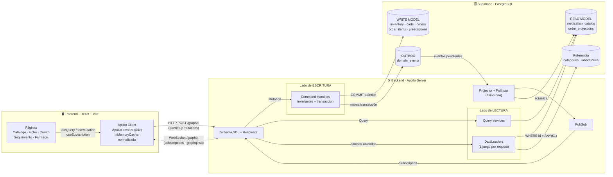
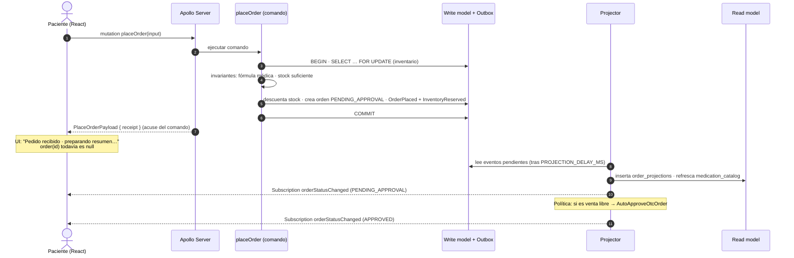
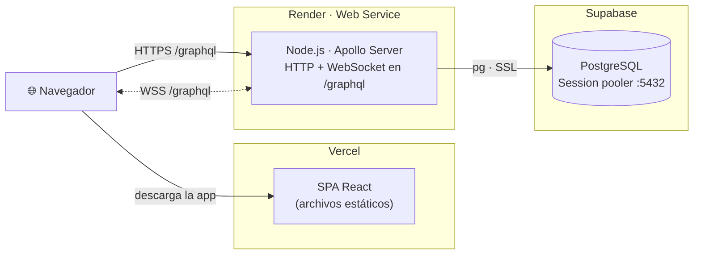

# 01 · Arquitectura

[← Índice](README.md)

## 1. Vista general

El sistema tiene tres piezas: un **frontend React** que solo habla GraphQL, un **backend Apollo Server** organizado como monolito modular con los lados de escritura y lectura separados, y una base de datos **PostgreSQL en Supabase** con tablas distintas para el *write model* y el *read model*.

**Cómo leer el diagrama**

- Una **Mutation** nunca toca el read model: entra por un *Command Handler*, que valida invariantes y confirma en una sola transacción el nuevo estado **y** los eventos de dominio (outbox).
- Una **Query** nunca toca el write model: lee proyecciones desnormalizadas. Las relaciones anidadas (`category`, `laboratory`, `medication`) se resuelven en lote con **DataLoader**.
- El **Projector** consume el outbox de forma asíncrona, actualiza las proyecciones y publica el resultado en **PubSub**, que alimenta las **Subscriptions**.

---

## 2. Flujo de un pedido (consistencia eventual)

El detalle de cada paso está en [04 · CQRS](04_CQRS.md).

---

## 3. Despliegue

| Pieza | Plataforma | Por qué |
|---|---|---|
| Frontend | **Vercel** | Sirve la SPA como archivos estáticos con redeploy automático desde GitHub. |
| Backend | **Render** (Web Service) | Es un proceso Node **persistente**, así que mantiene conexiones **WebSocket**: las GraphQL Subscriptions funcionan en producción. |
| Base de datos | **Supabase** | PostgreSQL administrado exigido por el taller. El backend usa el *Session pooler* (IPv4), adecuado para un servidor persistente. |

> El backend también incluye un adaptador serverless ([`vercel-handler.ts`](../backend/src/vercel-handler.ts)) para correr en Vercel. En ese modo no hay WebSocket y el frontend cambia a *polling* con una sola variable (`VITE_ENABLE_SUBSCRIPTIONS=false`). Se conserva como alternativa, pero producción usa Render.

---

## 4. Organización del backend (monolito modular)

Cada carpeta tiene una sola responsabilidad y pertenece a un lado de CQRS:

| Carpeta | Responsabilidad | Lado |
|---|---|---|
| [`src/domain/`](../backend/src/domain) | Reglas puras: máquina de estados, validación de la fórmula, errores y eventos de dominio. Sin acceso a BD. | Dominio |
| [`src/commands/`](../backend/src/commands) | *Command Handlers*: validan entrada (Zod), abren transacción, verifican invariantes, persisten y escriben en el outbox. | **Escritura** |
| [`src/projections/`](../backend/src/projections) | Projector, handlers de proyección y políticas (aprobación automática OTC). | Escritura → Lectura |
| [`src/queries/`](../backend/src/queries) | Consultas SQL de solo lectura sobre las proyecciones. | **Lectura** |
| [`src/dataloaders/`](../backend/src/dataloaders) | Un juego de DataLoaders por request (anti N+1). | **Lectura** |
| [`src/graphql/`](../backend/src/graphql) | Schema, scalars, resolvers (delgados: delegan en comandos o consultas), contexto y plugin de logs. | Contrato |
| [`src/infra/`](../backend/src/infra) | Pool de PostgreSQL con métricas por request, logger, PubSub, tareas en segundo plano. | Infraestructura |
| [`src/http/app.ts`](../backend/src/http/app.ts) | Express + Apollo. Monta **solo** `/graphql`. | Transporte |

**¿Por qué monolito modular y no federación?** Hay un solo equipo y un solo contexto de negocio (catálogo + pedidos). Separar en *subgraphs* con Apollo Router añadiría un salto de red y coordinación de despliegues sin un beneficio real a esta escala. La separación en carpetas por responsabilidad permite extraer un subgraph más adelante si hiciera falta.

---

## 5. Stack

| Capa | Tecnología |
|---|---|
| Lenguaje | TypeScript en backend y frontend |
| Backend | Node.js + **Apollo Server 5** sobre Express |
| Subscriptions | `graphql-ws` + `ws` en el mismo endpoint `/graphql` |
| Resolución en lote | **DataLoader** (instancias nuevas por request) |
| Validación de comandos | Zod |
| Base de datos | **PostgreSQL en Supabase** (driver `pg`, transacciones reales) |
| Frontend | **React 19 + Vite** + React Router, Tailwind CSS 4 |
| Cliente GraphQL | **Apollo Client 4** + GraphQL Code Generator (operaciones tipadas) |
| Pruebas | Vitest (dominio) + prueba de humo de extremo a extremo (`npm run smoke`) |
