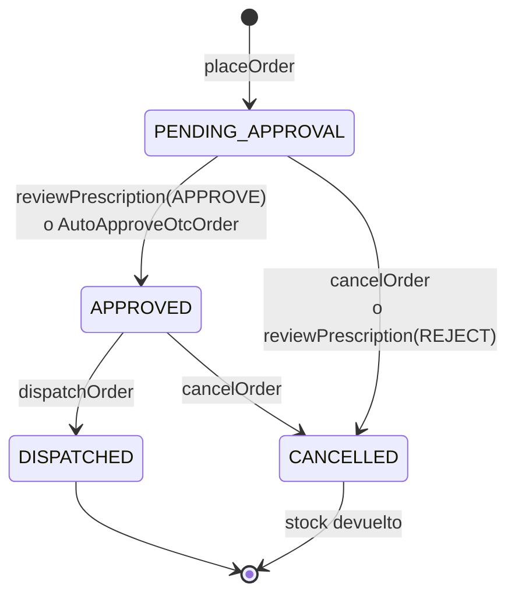

# 04 · CQRS, invariantes y consistencia eventual

[← Índice](README.md) · Criterio 2 de la rúbrica (25 %)

---

## 1. Segregación conceptual y técnica

La separación no es solo de carpetas: **lectura y escritura usan tablas distintas** y código distinto.

| | **Write model** (comandos) | **Read model** (consultas) |
|---|---|---|
| Operación GraphQL | `Mutation` | `Query` y `Subscription` |
| Tablas | `inventory`, `carts`, `cart_items`, `orders`, `order_items`, `prescriptions`, `users` ([002_write_model.sql](../database/migrations/002_write_model.sql)) | `medication_catalog`, `order_projections` ([003_read_model.sql](../database/migrations/003_read_model.sql)) |
| Forma de los datos | Normalizada y transaccional, con restricciones (`CHECK`, índices únicos) | **Desnormalizada**: documento de búsqueda precalculado; ítems e historial de la orden en JSONB, listos para pintar |
| Quién escribe | Solo los *Command Handlers* ([`src/commands/`](../backend/src/commands)) | Solo el **Projector** ([`src/projections/`](../backend/src/projections)) |
| Quién lee | Los propios comandos, para validar invariantes | [`src/queries/`](../backend/src/queries) y los DataLoaders |
| Qué devuelve al cliente | Un **acuse** (`OrderReceipt`): estado confirmado por la transacción | La **proyección** (`OrderSummary`): vista completa, eventualmente consistente |

Reglas que se cumplen en todo el código:

- Una mutation **nunca** devuelve la proyección; devuelve el acuse del comando.
- Una query **nunca** invoca un comando ni lee tablas del write model.
- El catálogo que ve el usuario (`medication_catalog`) es una proyección: su disponibilidad puede ir unos instantes atrás, pero el comando **siempre valida contra el inventario real** (write model).

---

## 2. Comandos con intención de negocio

| Comando | Intención | Actor |
|---|---|---|
| `createCart`, `addItemToCart`, `updateCartItemQuantity`, `removeItemFromCart`, `clearCart` | Armar el pedido en un carrito del servidor | Paciente |
| `placeOrder` | Confirmar la compra: validar fórmula, reservar stock y crear la orden | Paciente |
| `cancelOrder` | Cancelar antes del despacho y devolver el stock | Paciente o farmacéutico |
| `reviewPrescription` | Aprobar o rechazar la fórmula médica | Farmacéutico |
| `dispatchOrder` | Entregar una orden aprobada a la transportadora | Farmacéutico |
| `AutoApproveOtcOrder` | Aprobar automáticamente las órdenes de venta libre | **Sistema** (disparado por una política) |

Cada *Command Handler* sigue los mismos cinco pasos ([order.commands.ts:1-10](../backend/src/commands/order.commands.ts#L1-L10)):

1. Valida la entrada con Zod → `ValidationError` con errores por campo.
2. Abre **una** transacción y bloquea las filas que va a modificar (`SELECT … FOR UPDATE`).
3. Verifica las invariantes; si alguna falla, lanza un error de dominio y se hace **ROLLBACK completo**.
4. Persiste el nuevo estado **y** los eventos de dominio en el outbox, en la misma transacción.
5. Tras el COMMIT, avisa al Projector.

---

## 3. Invariantes de negocio protegidas

| # | Invariante | Dónde se protege | Error devuelto |
|---|---|---|---|
| 1 | Un pedido con algún medicamento `requires_prescription = true` **exige** soporte de fórmula médica | [order.commands.ts:194-199](../backend/src/commands/order.commands.ts#L194-L199) | `PrescriptionRequiredError` (lista los medicamentos afectados) |
| 2 | La fórmula debe ser **vigente** (no futura, máximo 30 días), del **mismo paciente** autenticado y con registro médico de formato válido | [prescription.ts:29-62](../backend/src/domain/prescription.ts#L29-L62), invocada en [order.commands.ts:200-204](../backend/src/commands/order.commands.ts#L200-L204) | `ValidationError` con el campo exacto |
| 3 | **No vender lo que no hay:** la reserva de inventario es atómica | [order.commands.ts:206-233](../backend/src/commands/order.commands.ts#L206-L233): `SELECT … FOR UPDATE` en orden ascendente de id (evita interbloqueos), verificación y `UPDATE` en la misma transacción. Última defensa en la BD: `CHECK (stock >= 0)` ([002_write_model.sql:45](../database/migrations/002_write_model.sql#L45)) | `InsufficientStockError` (medicamento, pedido y disponible) |
| 4 | Máximo 10 unidades de un mismo medicamento por pedido | [domain/order.ts:34](../backend/src/domain/order.ts#L34), aplicada en [cart.commands.ts:20](../backend/src/commands/cart.commands.ts#L20) y [cart.commands.ts:45-48](../backend/src/commands/cart.commands.ts#L45-L48) | `ValidationError` |
| 5 | Máquina de estados: `PENDING_APPROVAL → APPROVED → DISPATCHED`; cancelación solo antes del despacho | [domain/order.ts:16-31](../backend/src/domain/order.ts#L16-L31) (`assertTransition`) | `InvalidStateTransitionError` |
| 6 | Una orden con fórmula **solo** la aprueba un químico farmacéutico; las de venta libre se aprueban automáticamente | Rol exigido en [mutation.resolvers.ts:66-76](../backend/src/graphql/resolvers/mutation.resolvers.ts#L66-L76); `reviewPrescription` rechaza órdenes sin fórmula ([order.commands.ts:366-372](../backend/src/commands/order.commands.ts#L366-L372)) | `FORBIDDEN` / `InvalidStateTransitionError` |
| 7 | Un carrito confirmado no se vuelve a comprar, y un doble clic no duplica pedidos | Estado del carrito ([order.commands.ts:174-181](../backend/src/commands/order.commands.ts#L174-L181)); `idempotencyKey` ([order.commands.ts:165-172](../backend/src/commands/order.commands.ts#L165-L172)) con índice único ([002_write_model.sql:94-95](../database/migrations/002_write_model.sql#L94-L95)); un solo carrito abierto por usuario ([002_write_model.sql:61-62](../database/migrations/002_write_model.sql#L61-L62)) | `InvalidStateTransitionError` o se devuelve la orden ya creada |
| 8 | Cancelar o rechazar la fórmula **devuelve el stock** a bodega | `releaseInventory` en la misma transacción ([order.commands.ts:132-148](../backend/src/commands/order.commands.ts#L132-L148)) | — |

Además, **los precios y las banderas de fórmula se toman del write model, nunca del cliente** ([order.commands.ts:183-191](../backend/src/commands/order.commands.ts#L183-L191)): un cliente manipulado no puede cambiar el precio ni saltarse la exigencia de fórmula.

### Máquina de estados de la orden

---

## 4. Consistencia eventual: estrategia en el servidor

### 4.1 Transactional Outbox

Cada comando registra sus eventos de dominio (`OrderPlaced`, `InventoryReserved`, `OrderApproved`, `OrderCancelled`, `InventoryReleased`, `OrderDispatched`) en la tabla `domain_events` **dentro de la misma transacción** que el cambio de estado ([order.commands.ts:290-314](../backend/src/commands/order.commands.ts#L290-L314)). O se confirma todo o no se confirma nada: nunca hay una orden sin su evento, ni un evento de una orden que no existe.

### 4.2 Projector asíncrono

Tras el COMMIT, el comando llama a `notifyNewEvents()`. Este espera `PROJECTION_DELAY_MS` (1,5 s en la demo) y procesa el outbox en segundo plano ([projector.ts:192-198](../backend/src/projections/projector.ts#L192-L198)). El retardo es **deliberado**: hace visible la consistencia eventual en la demostración y en producción podría ser `0`.

Garantías del proyector ([projector.ts:84-136](../backend/src/projections/projector.ts#L84-L136)):

| Garantía | Cómo |
|---|---|
| **Orden estricto** | Un *advisory lock* de PostgreSQL (`pg_try_advisory_xact_lock`) asegura un único proyector activo; los eventos se aplican en orden de `id`. |
| **Idempotencia** | Cada proyección guarda `last_event_id` y solo aplica eventos más nuevos (`where last_event_id < $n`, [order.projection.ts:73](../backend/src/projections/order.projection.ts#L73)). Aplicar dos veces el mismo evento no cambia nada. |
| **Aislamiento de fallos** | Cada evento se aplica dentro de un `SAVEPOINT`. Si falla, se registra `last_error`, se incrementa `attempts` (máximo 5) y los demás eventos siguen. |
| **Recuperación** | Un barrido cada 10 s ([local-server.ts:17](../backend/src/local-server.ts#L17), [local-server.ts:68-82](../backend/src/local-server.ts#L68-L82)) retoma eventos pendientes y aprobaciones automáticas perdidas ([policies.ts:26-40](../backend/src/projections/policies.ts#L26-L40)). |
| **Versionado** | Cada proyección de orden lleva `projectionVersion` (eventos aplicados) y `syncedAt`, expuestos en el schema para que la UI sepa qué tan fresca es. |

### 4.3 Política (process manager)

Cuando se proyecta un `OrderPlaced` **sin** fórmula, se dispara la política de aprobación automática: tras `AUTO_APPROVE_DELAY_MS` ejecuta el comando de sistema `AutoApproveOtcOrder`, que genera un nuevo `OrderApproved` ([projector.ts:50-55](../backend/src/projections/projector.ts#L50-L55), [policies.ts:15-20](../backend/src/projections/policies.ts#L15-L20)). El comando es idempotente: si la orden ya no está pendiente, no hace nada.

### 4.4 Publicación a las subscriptions

El proyector publica en PubSub **la proyección ya confirmada** (después del COMMIT), una por cada evento aplicado, para que el cliente vea **todas** las transiciones ([projector.ts:142-147](../backend/src/projections/projector.ts#L142-L147)). Las subscriptions filtran por orden y por dueño: un paciente solo recibe sus propias órdenes ([subscription.resolvers.ts:16-29](../backend/src/graphql/resolvers/subscription.resolvers.ts#L16-L29)).

---

## 5. ¿Qué ve el usuario mientras tanto?

La pregunta del enunciado se responde con estas cinco situaciones:

| Situación | Qué pasa en el sistema | Qué ve el usuario | Código |
|---|---|---|---|
| Acaba de confirmar el pedido | El write model ya tiene la orden, pero `order(id)` todavía es `null` porque la proyección no existe | "**Pedido {código} recibido** · preparando el resumen de tu pedido…" con el total confirmado. La vista consulta periódicamente hasta que aparece la proyección. | [CartPage.tsx:98](../frontend/src/pages/CartPage.tsx#L98) guarda el acuse en `pendingOrdersVar`; [OrderTrackingPage.tsx:67-86](../frontend/src/pages/OrderTrackingPage.tsx#L67-L86) |
| Va a "Mis pedidos" antes de la proyección | La lista del read model aún no incluye la orden | Una tarjeta **"Procesando… (comando aceptado, proyección en camino)"** con el código y el total | [OrdersPage.tsx:14-28](../frontend/src/pages/OrdersPage.tsx#L14-L28) |
| El pedido cambia de estado (aprobado, despachado) | El proyector publica la proyección por la subscription | El seguimiento avanza **solo**, sin recargar: barra de progreso e historial | [OrderTrackingPage.tsx:40-47](../frontend/src/pages/OrderTrackingPage.tsx#L40-L47) (`useSubscription` + `writeQuery`) |
| Cancela un pedido | El comando confirma `CANCELLED`, pero el historial proyectado aún no tiene el evento | El estado cambia **al instante** (caché actualizada con el acuse) y aparece "Cambio confirmado por el servidor. Sincronizando el historial…" hasta que `projectionVersion` avanza | [OrderTrackingPage.tsx:49-65](../frontend/src/pages/OrderTrackingPage.tsx#L49-L65) |
| Consulta la disponibilidad de un medicamento | El catálogo proyectado puede ir unos instantes atrás del inventario real | "**Inventario sincronizado hace X s · se confirma al pagar**". Si el stock ya no alcanza, el comando responde `InsufficientStockError` con el detalle | [MedicationDetailPage.tsx:118](../frontend/src/pages/MedicationDetailPage.tsx#L118) |

---

## 6. Qué se ve en los logs

El logger etiqueta cada lado de CQRS por separado, para que en la sustentación se distinga qué pasa en cada momento:

| Etiqueta | Lado | Ejemplo de qué registra |
|---|---|---|
| `COMMAND` | Escritura | El comando ejecutado, el código de la orden, el total y si lleva fórmula |
| `PROJECTOR` | Escritura → Lectura | "Nuevos eventos en el outbox → proyección en 1500ms (consistencia eventual)", cada evento proyectado y cada publicación a subscriptions |
| `GRAPHQL` | Contrato | Inicio y fin de cada operación con el número de consultas SQL |
| `SQL` / `DATALOADER` | Lectura | Cada consulta y cada lote (ver [03 · N+1](03_N1_DATALOADER.md)) |

Los mensajes están definidos en [order.commands.ts:319-327](../backend/src/commands/order.commands.ts#L319-L327), [projector.ts:123](../backend/src/projections/projector.ts#L123), [projector.ts:145](../backend/src/projections/projector.ts#L145) y [projector.ts:193](../backend/src/projections/projector.ts#L193). En el video de sustentación se muestra el flujo completo en la terminal del servidor.
