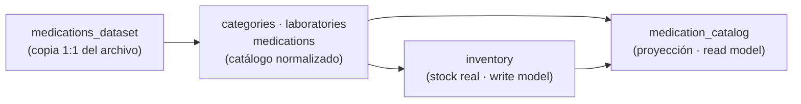

# 06 · Persistencia en Supabase

[← Índice](README.md) · Criterio 4 de la rúbrica (15 %)

---

## 1. Carga del dataset

El dataset de **50 medicamentos** del enunciado se carga en tres pasos, todos versionados en SQL:

| Paso | Archivo | Qué hace |
|---|---|---|
| 1 | [seed/001_medications_dataset.sql](../database/seed/001_medications_dataset.sql) | Inserta las 50 filas **tal cual** en una tabla de *staging* (`medications_dataset`). También existe en CSV ([medications_dataset.csv](../database/seed/medications_dataset.csv)). |
| 2 | [seed/002_normalize_catalog.sql](../database/seed/002_normalize_catalog.sql) | Normaliza en `categories`, `laboratories` y `medications`; crea el `inventory` con el stock inicial; construye la proyección `medication_catalog`. Es **idempotente**: se puede ejecutar varias veces sin duplicar datos. |
| 3 | [seed/003_demo_users.sql](../database/seed/003_demo_users.sql) | Crea el paciente y el farmacéutico de demostración. |

Todo se puede ejecutar de una vez con [`database/supabase_setup.sql`](../database/supabase_setup.sql) en el SQL Editor de Supabase, o con `npm run db:setup` desde `backend/`.

**Por qué normalizar:** el archivo original trae la categoría y el laboratorio como texto repetido. Llevarlos a tablas propias permite **relaciones anidadas reales** en GraphQL (`Medication.category`, `Medication.laboratory`, `Category.medications`), que es donde aparece el problema N+1 que el taller pide resolver.

### Verificación en la base de datos de producción

Consulta ejecutada el 24/09/2026 contra Supabase:

| Tabla | Filas |
|---|---|
| `medications_dataset` (original) | **50** |
| `medications` (normalizada) | **50** |
| `medication_catalog` (proyección) | **50** |
| `categories` | **14** |
| `laboratories` | **16** |
| Medicamentos con `requires_prescription = true` | **27** (y 23 de venta libre) |

### Erratas corregidas del archivo original

Se corrigieron 3 errores tipográficos evidentes y quedaron documentados en la cabecera de [001_medications_dataset.sql](../database/seed/001_medications_dataset.sql#L4-L8):

| SKU | Campo | Original | Corregido |
|---|---|---|---|
| MED-017 | `active_ingredient` | Hdoclorotiazida | Hidroclorotiazida |
| MED-034 | `active_ingredient` | Aprazolam | Alprazolam |
| MED-050 | `presentation` | Frsco x 500 ml | Frasco x 500 ml |

Se corrigieron porque la búsqueda por principio activo (escenario A) no encontraría "hidroclorotiazida" ni "alprazolam" con la errata.

---

## 2. Modelo de datos

| Migración | Contenido |
|---|---|
| [001_catalog.sql](../database/migrations/001_catalog.sql) | Extensiones (`pg_trgm`, `unaccent`, `pgcrypto`), staging del dataset y catálogo normalizado. |
| [002_write_model.sql](../database/migrations/002_write_model.sql) | **Write model**: usuarios, inventario, carritos, órdenes, ítems, fórmulas y el **outbox** `domain_events`. |
| [003_read_model.sql](../database/migrations/003_read_model.sql) | **Read model**: proyecciones `medication_catalog` y `order_projections`, y la función `refresh_medication_catalog`. |
| [004_security.sql](../database/migrations/004_security.sql) | Row Level Security en todas las tablas (Zero-REST). |

Las invariantes críticas también se protegen **en la base de datos**, como última línea de defensa si el código fallara:

| Restricción | Dónde |
|---|---|
| `CHECK (stock >= 0)`: el inventario nunca queda negativo | [002_write_model.sql:45](../database/migrations/002_write_model.sql#L45) |
| Un solo carrito abierto por usuario (índice único parcial) | [002_write_model.sql:61-62](../database/migrations/002_write_model.sql#L61-L62) |
| Idempotencia de `placeOrder`: `(user_id, idempotency_key)` único | [002_write_model.sql:94-95](../database/migrations/002_write_model.sql#L94-L95) |
| Una sola fórmula por orden (`order_id` único) | [002_write_model.sql:116](../database/migrations/002_write_model.sql#L116) |
| `CHECK (sku ~ '^MED-[0-9]{3}$')` y `CHECK (price >= 0)` | [001_catalog.sql:51](../database/migrations/001_catalog.sql#L51), [001_catalog.sql:58](../database/migrations/001_catalog.sql#L58) |
| Estados como tipos `enum` de PostgreSQL (`order_status`, `prescription_status`…) | [002_write_model.sql:11-25](../database/migrations/002_write_model.sql#L11-L25) |

---

## 3. Índices: consultas bien indexadas

La base de datos de producción tiene **43 índices** en el schema `public` (incluidas claves primarias y únicas). Los diseñados para las consultas del sistema son:

### 3.1 Read model: búsqueda facetada del catálogo

[003_read_model.sql:35-46](../database/migrations/003_read_model.sql#L35-L46):

| Índice | Tipo | Consulta que acelera |
|---|---|---|
| `idx_catalog_search_trgm` | **GIN con trigramas** sobre `search_text` | Búsqueda parcial `LIKE '%texto%'` por nombre comercial, principio activo, categoría, laboratorio o SKU, sin distinguir tildes |
| `idx_catalog_ingredient_trgm` | GIN con trigramas sobre `lower(active_ingredient)` | Filtro por principio activo |
| `idx_catalog_category`, `idx_catalog_laboratory` | B-tree | Facetas por categoría y laboratorio; lotes de DataLoader por `category_id` |
| `idx_catalog_prescription`, `idx_catalog_availability` | B-tree | Filtros "venta libre / con fórmula" y disponibilidad |
| `idx_catalog_price`, `idx_catalog_name` | B-tree compuesto `(campo, medication_id)` | Ordenamiento por precio o nombre con desempate estable para la paginación |

**Documento de búsqueda precalculado:** `search_text` se calcula una vez en la proyección como `lower(unaccent(nombre + principio activo + categoría + laboratorio + sku))` ([003_read_model.sql:69](../database/migrations/003_read_model.sql#L69)). La consulta del catálogo filtra una sola columna indexada en lugar de hacer `JOIN` y `ILIKE` sobre cinco campos en cada búsqueda. Es la ventaja de tener un modelo **optimizado para lectura**.

### 3.2 Read model: órdenes

[003_read_model.sql:122-123](../database/migrations/003_read_model.sql#L122-L123):

| Índice | Consulta que acelera |
|---|---|
| `idx_order_proj_user (user_id, placed_at desc)` | "Mis pedidos" del paciente, ya ordenados |
| `idx_order_proj_status (status, placed_at desc)` | Bandeja del farmacéutico filtrada por estado |

### 3.3 Write model y outbox

| Índice | Consulta que acelera |
|---|---|
| `idx_domain_events_pending` — **índice parcial** `WHERE processed_at IS NULL` ([002_write_model.sql:147-148](../database/migrations/002_write_model.sql#L147-L148)) | El proyector busca solo eventos pendientes; el índice no crece con los eventos ya procesados |
| `idx_orders_user`, `idx_orders_status`, `idx_order_items_order`, `idx_prescriptions_status` | Bloqueo y lectura de las filas que usan los comandos |

---

## 4. Seguridad: Zero-REST también en la base de datos

Supabase expone automáticamente una **API REST** (PostgREST) sobre las tablas del schema `public`. Si quedara abierta, un cliente podría leer o escribir datos sin pasar por GraphQL, lo que violaría el mandato Zero-REST.

[004_security.sql](../database/migrations/004_security.sql) activa **Row Level Security sin políticas** en las 14 tablas. Así, los roles públicos de esa API (`anon`, `authenticated`) no tienen acceso a ninguna fila. El backend se conecta con el rol dueño de las tablas, así que el **único camino a los datos es el backend GraphQL**.

Verificado en producción: las **14 tablas** del schema `public` tienen RLS activo.

---

## 5. Conexión desde el backend

- Driver `pg` con un pool de conexiones y **transacciones reales** (`BEGIN` / `COMMIT` / `ROLLBACK`) para los comandos ([db.ts:86-99](../backend/src/infra/db.ts#L86-L99)).
- Conexión por el **Session pooler** de Supabase (IPv4, puerto 5432), adecuado para un servidor persistente con subscriptions.
- Las credenciales viven solo en variables de entorno; el repositorio incluye únicamente `.env.example`.
